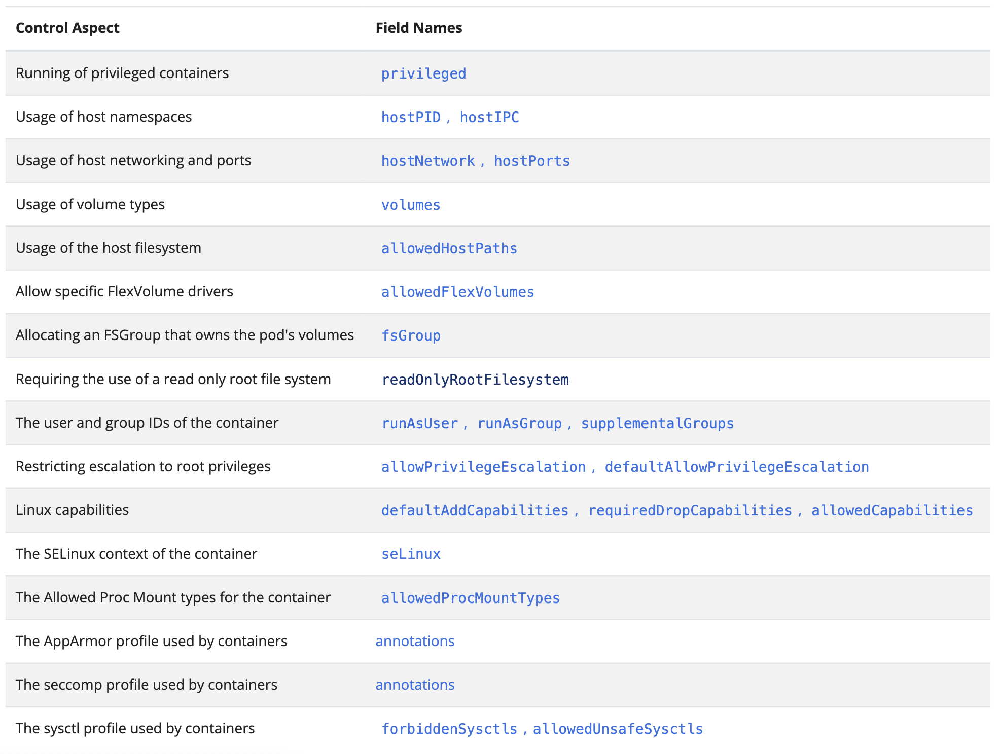

Une ressource de type *PodSecurityPolicy* est définie au niveau du cluster (non limitée à un namespace), elle permet de contrôler les options de sécurité présentes dans la spécification d'un Pod. Une PodSecurityPolicy (PSP) definit donc un ensemble de condition qu'un Pod doit respecter pour pouvoir être accepté dans le système.

Le tableau suivant liste les différents contrôles qui peuvent être effectués par les PSP, ainsi que les champs dédiés dans la spécification des Pods:



:warning: les PodSecurityPolicy sont dépréciées depuis Kubernetes 1.21 et seront supprimées à partir de la version 1.25, il est cependant intéressant de comprendre leur fonctionnement car elles sont encore utilisées sur de nombreux clusters.

## Pré-requis

Pour cet exercice, il est recommandé d'avoir un cluster créé avec *kubeadm* comme détaillé dans un exercice précédent:
[https://gitlab.com/lucj/k8s-exercices/-/blob/master/Installation/kubeadm.md](https://gitlab.com/lucj/k8s-exercices/-/blob/master/Installation/kubeadm.md)

## Création de PodSecurityPolicy

Vous allez premièrement créer la PodSecurityPolicy suivante:


```
cat<<EOF | kubectl apply -f -
apiVersion: policy/v1beta1
kind: PodSecurityPolicy
metadata:
  name: privileged
  annotations:
    seccomp.security.alpha.kubernetes.io/allowedProfileNames: '*'
spec:
  privileged: true
  allowPrivilegeEscalation: true
  allowedCapabilities:
  - '*'
  volumes:
  - '*'
  hostNetwork: true
  hostPorts:
  - min: 0
    max: 65535
  hostIPC: true
  hostPID: true
  runAsUser:
    rule: 'RunAsAny'
  seLinux:
    rule: 'RunAsAny'
  supplementalGroups:
    rule: 'RunAsAny'
  fsGroup:
    rule: 'RunAsAny'
EOF
```

Cette PSP est permissive car elle n'impose pas de restrictions particulières aux Pods.

Afin que *kubelet* puisse lancer les Pods systèmes (notamment lorsque l'API Server sera redémarré dans la section suivante) il est nécessaire de lui autoriser l'utilisation des PodSecurityPolicy en créant les ressources suivantes:

- un ClusterRole qui définit l'utilisation des resources de type PodSecurityPolicy

```
cat <<EOF | kubectl apply -f - 
apiVersion: rbac.authorization.k8s.io/v1
kind: ClusterRole
metadata:
  name: psp-access
rules:
- apiGroups:
  - policy
  resources:
  - podsecuritypolicies
  verbs:
  - use
EOF
```

- un ClusterRoleBinding qui permet d'associer le ClusterRole précédent à l'agent kubelet du node *master*:

```
cat <<EOF | kubectl apply -f - 
apiVersion: rbac.authorization.k8s.io/v1
kind: ClusterRoleBinding
metadata:
  name: psp-access
roleRef:
  apiGroup: rbac.authorization.k8s.io
  kind: ClusterRole
  name: psp-access
subjects:
- apiGroup: rbac.authorization.k8s.io
  kind: User
  name: system:node:master
EOF
```

:warning: la création des ressources précédentes permettent d'associer au *kubelet* du node *master* les droits d'utilisation des PodSecurityPolicy (et notamment de celle nommé *privileged* que vous avez créée précédemment) car sans ces droits *kubelet* ne sera pas capable de relancer les Pods du control plane. Cela est nécessaire car dans la partie suivante vous allez modifier une option de démarrage de l'API Server ce qui nécessitera le redémarrage du Pod. 

## Activation des PodSecurityPolicy

Depuis le node *master*, modifiez le fichier manifest lié à l'API Server (*/etc/kubernetes/manifests/kube-apiserver.yaml*) en ajoutant l'admission plugin nommé *PodSecurityPolicy* à la suite du plugin déjà activé):

```
spec:
  containers:
  - command:
    - kube-apiserver
    - --advertise-address=192.168.64.51
    - --allow-privileged=true
    - --authorization-mode=Node,RBAC
    - --client-ca-file=/etc/kubernetes/pki/ca.crt
    - --enable-admission-plugins=NodeRestriction,PodSecurityPolicy  # PodSecurityPolicy added
    - --enable-bootstrap-token-auth=true
```

Ce changement va entrainer le redémarrage de l'API Server après quelques dizaines de secondes.

## Tests

Une fois que le plugin PodSecurityPolicy est activé, plus aucun Pod ne peut être créé dans le cluster à moins que:
- ce Pod puisse utiliser une PodSecurityPolicy existante (via des droits sur le ServiceAccount associé)
- la PodSecurityPolicy lui permette d'être créé

En tant qu'administrateur du cluster, vous pouvez créer un Pod:

```
kubectl run db --image=mongo:5.0
```

En quelques secondes ce Pod sera dans l'état *Running*:

```
NAME   READY   STATUS    RESTARTS   AGE
db     1/1     Running   0          6s
```

Par contre, si vous créez un Deployment contenant un replica d'un Pod basé sur MongoDB:

```
kubectl create deployment mongo --image=mongo:5.0
```

Vous verrez qu'aucun Pod n'est créé pour ce Deployment:

```
$ kubectl get deploy mongo
NAME    READY   UP-TO-DATE   AVAILABLE   AGE
mongo   0/1     0            0           2m44s
```

Ceci provient du fait que:
- en tant qu'admin vous avez tous les droits sur le cluster, dont le droit d'utiliser la PodSecurityPolicy existante
- le service account utilisé pour lancer le Pod (au sein du Deployment *mongo*) n'a pas le droit d'utiliser de PodSecurityPolicy

Dans la suite, vous allez créer une PodSecurityPolicy plus restrictive que la première et l'associer au ServiceAccount *default* du namespace *default* (celui utilisé par le Pod créé par le Deployement *mongo*)

## Une PSP plus restrictive

Créez la PSP suivante, celle-ci empêche qu'un Pod soit lancé avec l'option *privileged*.

```
cat<<EOF | kubectl apply -f -
apiVersion: policy/v1beta1
kind: PodSecurityPolicy
metadata:
  name: unprivileged
spec:
  privileged: false
  seLinux:
    rule: RunAsAny
  supplementalGroups:
    rule: RunAsAny
  runAsUser:
    rule: RunAsAny
  fsGroup:
    rule: RunAsAny
  volumes:
  - '*'
EOF
```

Créez à présent le role suivante, celle-ci autorise l'utilisation de la PSP créée précedemment:

```
cat <<EOF | kubectl apply -f -
apiVersion: rbac.authorization.k8s.io/v1
kind: Role
metadata:
  name: unprivileged-psp-access
rules:
- apiGroups:
  - policy
  resources:
  - podsecuritypolicies
  resourceNames:
  - unprivileged
  verbs:
  - use
EOF
```

Créez ensuite le RoleBindig suivant, celle-ci autorise le ServiceAccount *default* du namespace *default* à utiliser la PodPolicySecurity *unprivileged*:

```
cat<<EOF | kubectl apply -f -
apiVersion: rbac.authorization.k8s.io/v1
kind: RoleBinding
metadata:
  name: unprivileged-psp-access
roleRef:
  apiGroup: rbac.authorization.k8s.io
  kind: Role
  name: unprivileged-psp-access
subjects:
- kind: ServiceAccount
  name: default
  namespace: default
EOF
```

Une fois ces différentes ressources créées, vous devriez observer que le Pod du Deployment *mongo* a été créé:

```
$ kubectl get po
NAME                        READY   STATUS      RESTARTS   AGE
mongodb-64c878557-wt8bh     1/1     Running     0          15s
```

Définissez à présent une Pod avec le status *privileged* et vérifier que la PodSecurityPolicy *unprivileged* l'empêche d'être créé dans la namespace *default*

<details>
  <summary markdown="span">Indice</summary>

Vous pouvez utiliser une spécification de Deployment comme celle ci-dessous:

```
apiVersion: apps/v1
kind: Deployment
metadata:
  name: alpine
spec:
  replicas: 1
  selector:
    matchLabels:
      app: alpine
  template:
    metadata:
      labels:
        app: alpine
    spec:
      containers:
      - image: alpine
        name: alpine
        securityContext:
          privileged: true
        command:
        - "sleep"
        - "10000"
```

Une fois le Deployment créé, vous verrez que la PSP associé au ServiceAccount *default*, celui associé au Pod, ne permet pas la création de ce dernier: 

```
$ kubectl get deploy alpine -o yaml
...
message: 'pods "alpine-d4b74c9df-" is forbidden: PodSecurityPolicy: unable to
      admit pod: [spec.containers[0].securityContext.privileged: Invalid value: true:
      Privileged containers are not allowed]'
```
</details>

## Dépréciation des PodSecurityPolicy

Les PSP sont dépréciées depuis Kubernetes 1.21 et seront surpprimées dans la version 1.25. Le lien suivant donne des détails supplémentaires sur les PSP et les raisons de leur fin de vie: [https://kubernetes.io/blog/2021/04/06/podsecuritypolicy-deprecation-past-present-and-future/](https://kubernetes.io/blog/2021/04/06/podsecuritypolicy-deprecation-past-present-and-future/)

Différentes solutions de remplacement sont disponibles telles que:
- [Kyverno](https://kyverno.io)
- [OPA/GateKeeper](https://github.com/open-policy-agent/gatekeeper/)